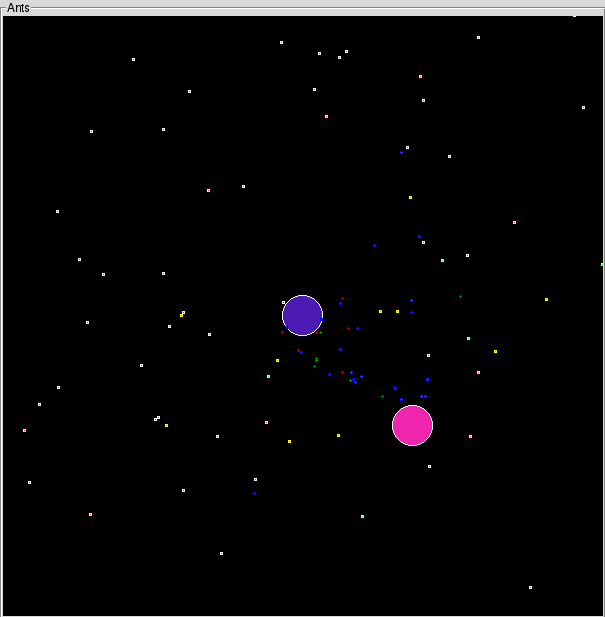

# Ants: A virtual random based ant-like life form


## Screenshot



## Disclaimer

This module is intended to run as a python 2.7 module and is provided AS IS under the WTFPL (See LICENSE.TXT).

This module has been tested on Linux systems **ONLY**.

However it uses python 2.7 standard modules only and it may run on Windows or MacOS.

Your mileage may vary.


## Content

* ./README.md
* ./LICENSE.TXT
* ./gendoc.sh
* ./screenshot.png
* ./ants.py
* ./ant.py
* ./config.py
* ./display.py
* ./farm.py
* ./mine.py
* ./playground.py
* ./utils.py
* ./doc/ant.html
* ./doc/ant.txt
* ./doc/config.html
* ./doc/config.txt
* ./doc/display.html
* ./doc/display.txt
* ./doc/farm.html
* ./doc/farm.txt
* ./doc/mine.html
* ./doc/mine.txt
* ./doc/playground.html
* ./doc/playground.txt
* ./doc/utils.html
* ./doc/utils.txt


## Goal

This programm tries to demonstrate that ants **may** have a life based on random and basic reflexes only.

It also provides a way to understand python multi-thread programming and inter-process communications.

This project is **NOT** a science project.


## API and documentation

The documentation can be generated by running the **gendoc.sh** shell script from within the module directory:

```
$ gendoc.sh
Generating documentation:
  [+] ./playground.py
  [+] ./config.py
  [+] ./farm.py
  [+] ./mine.py
  [+] ./ant.py
  [+] ./ants.py
  [+] ./display.py
  [+] ./utils.py
```

For all details on objects and there method and attributes, see all files in the **/doc** directory.


## TODO

* ~~A convenient way to close the application and all its threads (See 'Run the application') !~~
* Multiple farms on same map
* War between different ant factions
* Ant subclasses (worker, warrior, ...)
* Allow swarming when farm reach a number of individuals
* SDL2 implementation

## Install from file:

* Copy the module directory in any directory of your home dir.


## Install from github

Clone the Github repository with the followning command

```
$ git clone https://github.com/doug-letough/ants.git ants
```


## Configuration

You'll find a bunch of parameters to play with in the application configuration file **config.py**.

Default values will do fine.

## Run the Ants application

Run the following commands

```
$ cd ants
$ python -m ants
```

**This application is a massively multi-threaded program**.

Closing the main window SHOULD exit the application.

In case the application does not quit properly, run the following command to ensure that all remaining processes are killed:

```
$ kill -15 $(ps aux | grep "python -m ants" | grep -v grep | awk -F ' ' '{print $2}')
```


## Logging

This application logs many things to stderr.

If you want to keep the logs of your runs, start the application with the following command:

```
$ python -m ants 2>&1 | tee -a ants.log
```

This will still display the log to stderr and log this output to the ants.log file.


## Uninstall

Simply remove the module directory. 
